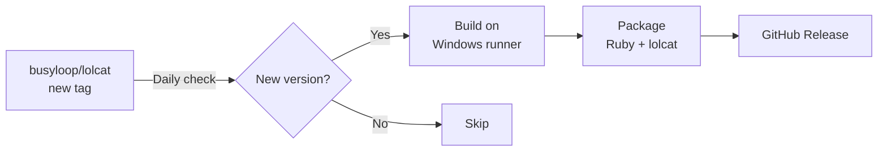

# lolcat for Windows

Standalone Windows builds of [lolcat](https://github.com/busyloop/lolcat) — because Windows users deserve rainbows too! 🌈

## Why?

The original `lolcat` only supports Linux (snap) and macOS (brew). This repo automatically watches for new releases and builds Windows binaries.

## Installation

1. Go to [Releases](../../releases/latest)
2. Download `lolcat-X.X.X-windows-x64.zip`
3. Extract to a folder (e.g., `C:\Tools\lolcat`)
4. (Optional) Add the folder to your PATH

## Usage

### Command Prompt (cmd.exe)

```cmd
echo Hello World | lolcat.bat
type myfile.txt | lolcat.bat
dir | lolcat.bat
```

### PowerShell

```powershell
echo "Hello World" | .\lolcat.ps1
Get-Content myfile.txt | .\lolcat.ps1
Get-ChildItem | .\lolcat.ps1
```

### Add to PATH (recommended)

To use `lolcat` from anywhere:

1. Press `Win + R`, type `sysdm.cpl`, press Enter
2. Go to **Advanced** → **Environment Variables**
3. Under **User variables**, select **Path**, click **Edit**
4. Click **New** and add the path to your lolcat folder (e.g., `C:\Tools\lolcat`)
5. Click **OK** on all dialogs
6. Restart your terminal

Now you can use:
```cmd
echo Hello World | lolcat
```

## How It Works



- **Daily check**: GitHub Actions runs at 03:00 UTC every day
- **Auto-build**: When a new tag is detected, it builds a standalone package
- **Portable**: Includes Ruby runtime — no installation needed on user's machine

## Building Locally

If you want to build manually:

```powershell
# Prerequisites: Ruby installed (e.g., via rubyinstaller.org)

# Install lolcat
gem install lolcat

# Run directly
echo "Hello" | ruby -S lolcat
```

## Credits

- [lolcat](https://github.com/busyloop/lolcat) by [busyloop](https://github.com/busyloop)
- This repo only provides Windows builds — all credit for lolcat goes to the original authors

## License

lolcat is licensed under [BSD-3-Clause](https://github.com/busyloop/lolcat/blob/master/LICENSE).

This build automation repo is also provided under BSD-3-Clause.
