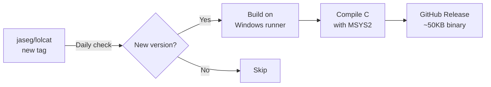

# lolcat for Windows

Standalone Windows builds of [lolcat](https://github.com/jaseg/lolcat) — the high-performance C implementation.

## Why?

The original [`busyloop/lolcat`](https://github.com/busyloop/lolcat) is a Ruby gem with no Windows support. This repo uses [`jaseg/lolcat`](https://github.com/jaseg/lolcat), a C reimplementation that's:

- **>10x faster** than the Ruby original
- **<0.1% the size** (~50KB vs ~30MB)
- **Single binary** — no Ruby, no dependencies

## Installation

1. Go to [Releases](../../releases/latest)
2. Download `lolcat-X.X.X-windows-x64.zip`
3. Extract to a folder (e.g., `C:\Tools\lolcat`)
4. (Optional) Add the folder to your PATH

## Usage

### Command Prompt (cmd.exe)

```cmd
echo Hello World | lolcat.exe
type myfile.txt | lolcat.exe
dir | lolcat.exe
```

### PowerShell

```powershell
echo "Hello World" | .\lolcat.exe
Get-Content myfile.txt | .\lolcat.exe
Get-ChildItem | .\lolcat.exe
```

### Add to PATH (recommended)

To use `lolcat` from anywhere:

1. Press `Win + R`, type `sysdm.cpl`, press Enter
2. Go to **Advanced** → **Environment Variables**
3. Under **User variables**, select **Path**, click **Edit**
4. Click **New** and add the path to your lolcat folder (e.g., `C:\Tools\lolcat`)
5. Click **OK** on all dialogs
6. Restart your terminal

Now you can use:
```cmd
echo Hello World | lolcat
```

## How It Works



- **Daily check**: GitHub Actions runs at 03:00 UTC every day
- **Auto-build**: When a new tag is detected, it compiles from C source
- **Single binary**: No dependencies, just `lolcat.exe`

## Credits

- Original [lolcat](https://github.com/busyloop/lolcat) by [busyloop](https://github.com/busyloop)
- C implementation [jaseg/lolcat](https://github.com/jaseg/lolcat) by [jaseg](https://github.com/jaseg)
- This repo only provides Windows builds

## License

lolcat is licensed under [BSD-3-Clause](https://github.com/jaseg/lolcat/blob/main/LICENSE).

This build automation repo is also provided under BSD-3-Clause.
